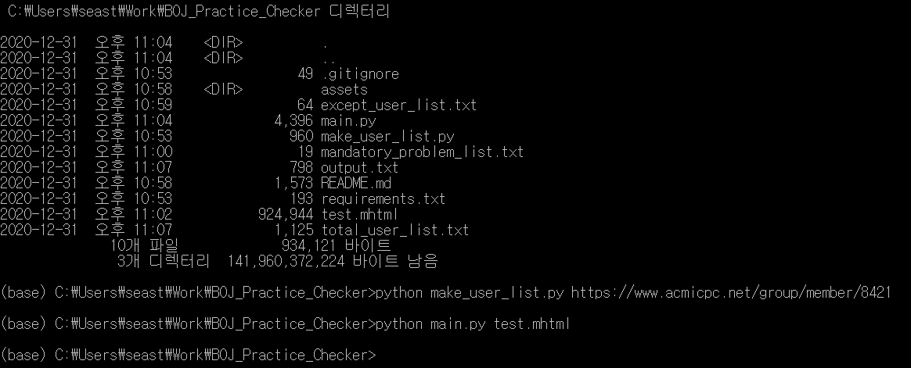
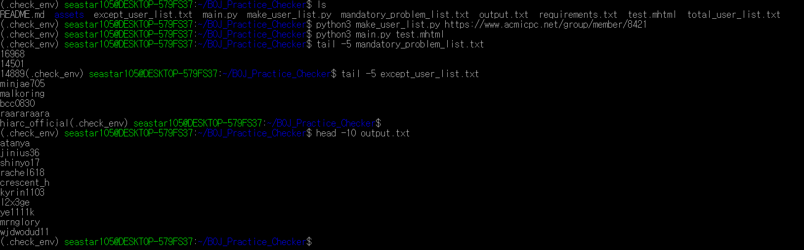

# BOJ Practice Checker

---

백준 온라인 저지의 그룹 연습 기능에서 안 푼 사람을 찾아주는 기능을 하는 파일들입니다. 

## How To Use

1. 체크하고자 하는 연습이 만들어져 있는 그룹의 멤버페이지 URL을 복사합니다. 

   

2.  "python3 make_user_list.py [Group Member Page URL]"를 실행하면 total_user_list.txt 파일이 만들어집니다. 이 파일은 그룹의 모든 멤버 아이디를 가지고 있습니다. --no-admin을 인자로 주면 관리자는 제외하고 가지게 됩니다.
3. 체크하고자 하는 연습 페이지로 이동해서 해당 페이지를 *.html 혹은 *.mhtml 형식으로 다운받고 같은 디렉토리에 넣어줍니다.
4. "python3 main.py [HTML File Name]"을 실행하면 연습 상의 문제들을 다 풀지 않은 멤버들의 아이디가 output.txt에 저장됩니다.
5. mandatory_problem_list.txt가 빈 파일이면 연습 상의 모든 문제를 체크하고, 비어있지 않다면 파일 상의 문제들만 모두 풀었는지 체크합니다. 기록은 한 줄에 하나의 문제 번호를 적어주세요.
6. 그룹 상의 모든 멤버를 체크하고 싶지 않은 경우, except_user_list.txt에 체크에서 제외할 멤버의 아이디를 한 줄에 하나씩 기록해주세요. main.py 실행 시 기록된 멤버는 제외하고 체크합니다.

## 실행 예시

### 윈도우 

### 리눅스

## Requirements

BeautifulSoup4(4.9.3에서는 돌아가고 4.9.0에서 안돌아가는 것을 확인했습니다.)

Requests

Python3

## Issue

기능 추가나 버그가 있으면 레포에 이슈를 만들어주시거나 seastar105@gmail.com으로 메일을 보내주세요.
